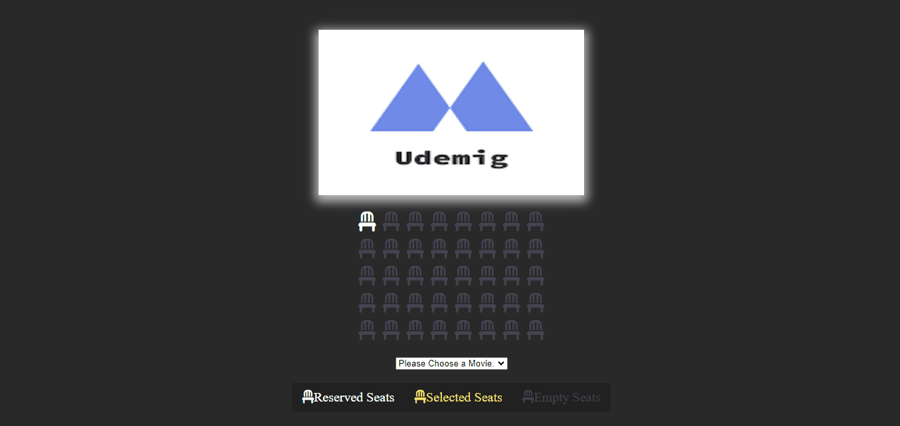

<h1> Cinema Project </h1>

<h2> Goal:</h2>

Creating a page using HTML,CSS and JS in order to select seats and buy tickets for an airing movie in a cinema.

<h2> Features:</h2>
<ul>
  <li>Selecting and deselecting seats.</li>
  <li>Switching between movies.</li>
  <li>Automatic calculation of ticket costs based on the movie and the number of selected seats.</li>
  <li>Movie selection and selected seats are stored in local storage of the browser.</li>
</ul>

<h2> Working GIF of the project:</h2>

